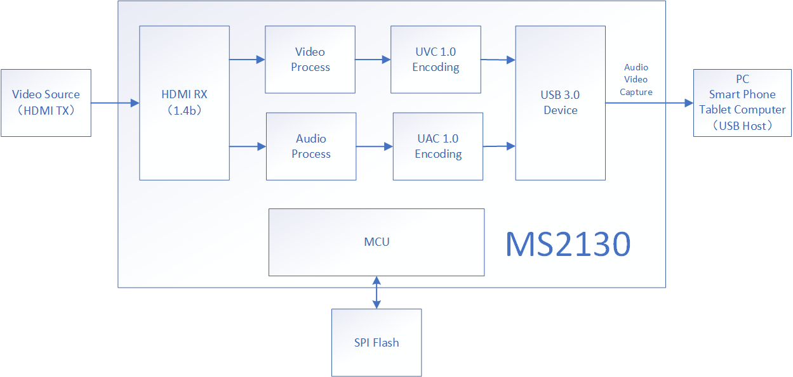
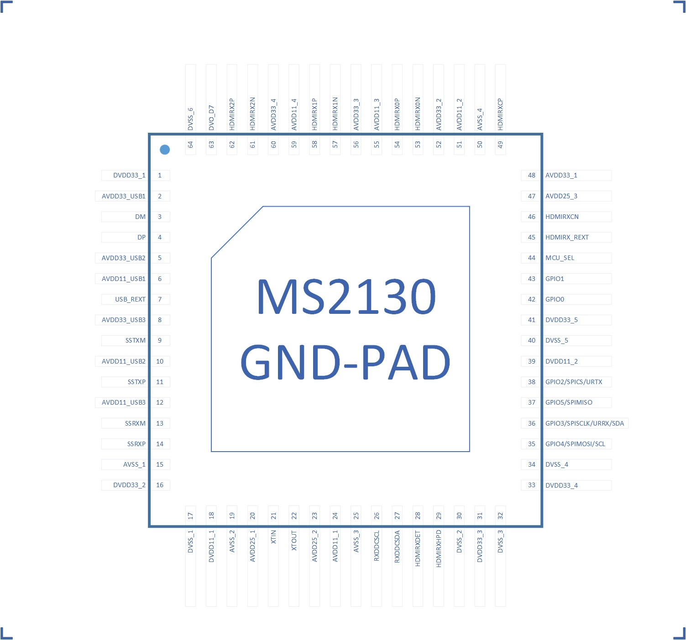
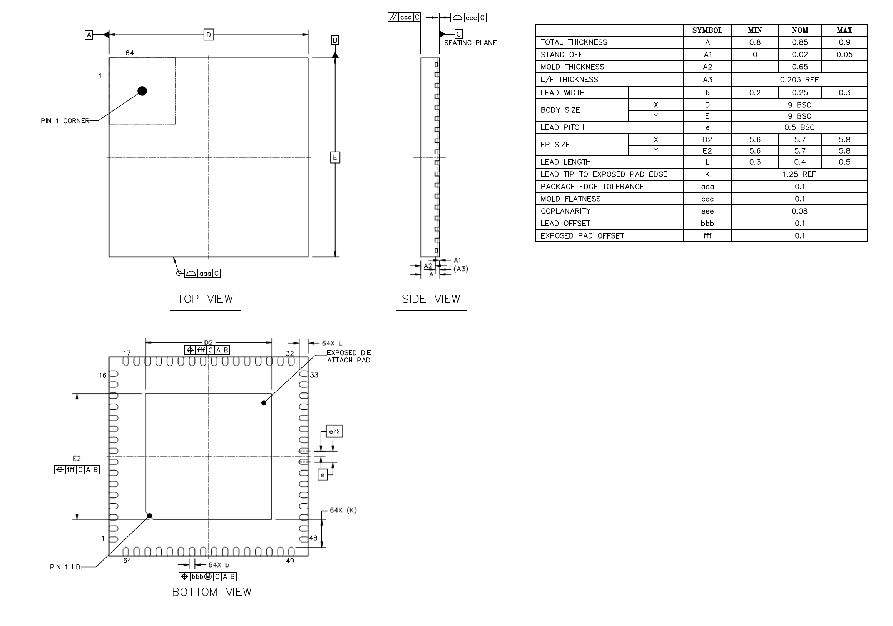

# MS2130 - USB3.0 高清视频采集芯片

## (非官方文档)

### 1.基本介绍

MS2130 是一款 USB 3.0 高清视频和音频采集芯片，内部集成 USB3.0 Device 控制器、数据收发模块、音视频处理模块。MS2130 可以通过 USB 3.0 接口将 HDMI 输入的音视频信号传送到 PC、智能手机、平板电脑上预览或采集。MS2130 输出支特 YUV422 和 MJPEG 两种模式，兼容 Windows、Android 和Mac OS 系统。

||MS2109|	MS2130|
|---             |---|---|
|USB  版本        |	2.0	|3.2 Gen1|
|USB 速率	        |480Mbps	|5Gbps|
|1080P@30 MJPEG	  |支持	|支持|
|1080P@60 MJPEG	  |不支持	|支持|
|1080P@30 YUV422	|不支持	|支持|
|1080P@60 YUV422	|不支持	|支持|
|典型延时	         |80ms	|50ms
		

### 2.功能特征

* HDMI RX
  * HDMI 1.4b 兼容
  * 支持 DVI 1.0
  * 支持 HDCP 1.4
  * 支持 RGB444、YCBCR422、YCBCR444、YCBCR420
  * 支持 deep color 24/30/36 位模式
  * 支持 CEA-861-E/CEA-861-F 视频格式
  * 最大输入分辨率 4K(3840×2160@30Hz)
  
* USB 3.0
  * 集成 USB 3.0 Device
  * 兼容 USB 2.0 Device 模式
  * USB 视频符合 UVC 1.0 协议
  * USB 音频符合 UAC 1.0 协议
  * USB 视频输出支持 YUV422 和 MJPEG 两种模式

* USB 视频输出分辨率
  * 默认最大分辨率1920×1080@60Hz
  
* 操作系统支持
  * Windows XP/7/8/10
  * Andriod 5.0 或以上
  * MacOS
  * Linux
  * 其他支持UVC的系统
  
* 时钟处理
  * 外接 24MHz 无源晶振
  * 内建 PLL 电路

* 复位
  * 内建上电复位电路

* 封装
  * QFN-64塑封（9mm×9mm)
  * 无铅，符合RoHS标准

### 3.功能框图

  

### 4.功能描述

* **GPIO**
  
  MS2130有6个可编程GPIO,可通过软件自定义功能。

* **HDMI RX EDID描述**
  
  |类别|描述|
  |---|---|
  |显示名称|HDMI TO USB|
  |最佳分辨率1|4K@30Hz,297MHz|
  |最佳分辨率2|1080P@60Hz,148.5MHz|
  |视频支持分辨率列表|640×480@60Hz 800×600@60Hz 1024×768@60Hz 1152×864@60Hz 1280×720@60Hz 1280×800@60Hz 1280×960@60Hz 1280×1024@60Hz 1440×900@60Hz 1600×900@60Hz 1680×1050@60Hz 1920×1080@60Hz 3840×2160@30Hz 4096×2160@30Hz|
  |视频色彩空间支持|RGB,YUV444,LYUV422,YUV420|
  |Deep color支持| 30bits,36bits|
  |音频格式支持|格式：L-PCM 采样率：32KHz,44.1KHz,48KHz 通道数：最大两通道 位数：16bit,20bit,24bit

* **USB 视频输出**
  
  MS2130支持USB3.0&USB2.0模式视频采集，符合UVC1.0协议，支持YUV422和MJPEG两种格式视频输出，默认最大输出分辨率1920×1080@60Hz。
  MS2130USB默认输出分辨率列表如下，可以通过修改软件配置，由用户自定义输出分辨率(最大可支持到4K@15Hz)。

  <table>
    <tr>
      <td >USB 模式</td>
      <td>YUV422</td>
      <td>MJPEG</td>
    </tr>
    <tr>
      <td rowspan="11">USB 3.0 模式</td>
      <td>1920×1080@60Hz/50Hz/30Hz/20Hz/10Hz</td>
      <td>1920×1080@60HZ/50Hz/30Hz/20Hz/10Hz</td>
    </tr>
    <tr>
      <td>1600×1200@60Hz/50Hz/30Hz/20Hz/10Hz</td>
      <td>1600×1200@60Hz/50Hz/30Hz/20Hz/10Hz</td>
    </tr>
    <tr>
      <td>1360×  768@60Hz/50Hz/30Hz/20Hz/10Hz</td>
      <td>1360×  768@60Hz/50Hz/30Hz/20Hz/10Hz</td>
    </tr>
    <tr>
      <td>1280×1024@60Hz/50Hz/30Hz/20Hz/10Hz</td>
      <td>1280×1024@60Hz/50Hz/30Hz/20Hz/10Hz</td>
    </tr>
    <tr>
      <td>1280×  960@60Hz/50Hz/30Hz/20Hz/10Hz</td>
      <td>1280×  960@60Hz/50Hz/30Hz/20Hz/10Hz</td>
    </tr>
    <tr>
      <td>1280×  720@60Hz/50Hz/30Hz/20Hz/10Hz</td>
      <td>1280×  720@60Hz/50Hz/30Hz/20Hz/10Hz</td>
    </tr>
    <tr>
      <td>1024×  768@60Hz/50Hz/30Hz/20Hz/10Hz</td>
      <td>1024×  768@60Hz/50Hz/30Hz/20Hz/10Hz</td>
    </tr>
    <tr>
      <td>  800×  600@60Hz/50Hz/30Hz/20Hz/10Hz</td>
      <td>  800×  600@60Hz/50Hz/30Hz/20Hz/10Hz</td>
    </tr>
    <tr>
      <td>  720×  576@60Hz/50Hz/30Hz/20Hz/10Hz</td>
      <td>  720×  576@60Hz/50Hz/30Hz/20Hz/10Hz</td>
    </tr>
    <tr>
      <td>  720×  480@60Hz/50Hz/30Hz/20Hz/10Hz</td>
      <td>  720×  480@60Hz/50Hz/30Hz/20Hz/10Hz</td>
    </tr>
    <tr>
      <td>  640×  480@60Hz/50Hz/30Hz/20Hz/10Hz</td>
      <td>  640×  480@60Hz/50Hz/30Hz/20Hz/10Hz</td>
    </tr>
    <tr>
      <td rowspan="11">USB 2.0 模式</td>
      <td>1920×1080@10Hz/5Hz</td>
      <td>1920×1080@50Hz/30Hz/25Hz/20Hz/10Hz</td>
    </tr>
    <tr>
      <td>1600×1200@10Hz/5Hz</td>
      <td>1600×1200@60Hz/50Hz/30Hz/20Hz/10Hz</td>
    </tr>
    <tr>
      <td>1360×  768@15Hz/8Hz</td>
      <td>1360×  768@60Hz/50Hz/30Hz/20Hz/10Hz</td>
    </tr>
    <tr>
      <td>1280×1024@15Hz/8Hz</td>
      <td>1280×1024@60Hz/50Hz/30Hz/20Hz/10Hz</td>
    </tr>
    <tr>
      <td>1280×  960@15Hz/8Hz</td>
      <td>1280×  960@60Hz/50Hz/30Hz/20Hz/10Hz</td>
    </tr>
    <tr>
      <td>1024×  768@20Hz/10Hz</td>
      <td>1024×  768@60Hz/50Hz/30Hz/20Hz/10Hz</td>
    </tr>
    <tr>
      <td>  800×  600@30Hz/20Hz/10Hz</td>
      <td>  800×  600@60Hz/50Hz/30Hz/20Hz/10Hz</td>
    </tr>
    <tr>
      <td>  720×  576@60Hz/25Hz/20Hz/10Hz</td>
      <td>  720×  576@60Hz/50Hz/30Hz/20Hz/10Hz</td>
    </tr>
    <tr>
      <td>  720×  480@60Hz/30Hz/20Hz/10Hz</td>
      <td>  720×  480@60Hz/50Hz/30Hz/20Hz/10Hz</td>
    </tr>
    <tr>
      <td>  640×  480@60Hz/30Hz/20Hz/10Hz</td>
      <td>  640×  480@60Hz/50Hz/30Hz/20Hz/10Hz</td>
    </tr>
  </table>

* **USB 音频输出**
  
  MS2130 USB音频符合UAC1.0协议，默认输出为48KHz立体声，可通过软件配置实现其它分辨率音频输出。

### 5.引脚
  

### 6.引脚描述

  <table>
    <tr>
      <td>引脚名称</td>
      <td>引脚#</td>
      <td>类型</td>
      <td>描述</td>
    </tr>
    <tr>
      <td colspan="4">通用IO</td>
    </tr>
    <tr>
      <td>GPIO0</td>
      <td>42</td>
      <td>数字输入/输出</td>
      <td>通用数字IO</td>
    </tr>
    <tr>
      <td>GPIO1</td>
      <td>43</td>
      <td>数字输入/输出</td>
      <td>通用数字IO</td>
    </tr>
    <tr>
      <td>GPIO2/SPICS/URTX</td>
      <td>38</td>
      <td>数字输入/输出</td>
      <td>通用数字IO,复用SPI Master接口CSPN和UART TX PIN; 如果外围连接了SPI接口Flash,芯片上电后会自动配置为SPICS功能</td>
    </tr>
    <tr>
      <td>GPIO3/SPISCLK/URRX/SDA</td>
      <td>36</td>
      <td>数字输入/输出</td>
      <td>通用数字IO,复用SPI Master接口SCLK PIN、UART RX PIN和I2C Master SDA PIN; 如果外围连接了SPI接口Flash,芯片上电后会自动配置为SPISCLK功能</td>
    </tr>
    <tr>
      <td>GPIO4/SPIMOSI/SCL</td>
      <td>35</td>
      <td>数字输入/输出</td>
      <td>通用数字IO,复用SPI Master接口MOSI PIN和I2C Master SCL PIN; 如果外围连接了SPI接口Flash,芯片上电后会自动配置为SPIMOSI功能</td>
    </tr>
    <tr>
      <td>GPIO5/SPIMISO</td>
      <td>37</td>
      <td>数字输入/输出</td>
      <td>通用数字IO,复用SPI Master接口MISO PIN; 如果外围连接了SPI接口Flash,芯片上电后会自动配置为SPI MISO功能</td>
    </tr>
    <tr>
      <td colspan="4">USB</td>
    </tr>
    <tr>
      <td>DP</td>
      <td>4</td>
      <td>数字输入/输出</td>
      <td>USB2.0差分正端信号</td>
    </tr>
    <tr>
      <td>DM</td>
      <td>3</td>
      <td>数字输入/输出</td>
      <td>USB2.0差分负端信号</td>
    </tr>
    <tr>
      <td>USB REXT</td>
      <td>7</td>
      <td>数字输出</td>
      <td>接200欧电阻到地</td>
    </tr>
    <tr>
      <td>SSTXP</td>
      <td>11</td>
      <td>数字输出</td>
      <td>USB3.0差分输出正端信号</td>
    </tr>
    <tr>
      <td>SSTXM</td>
      <td>9</td>
      <td>数字输出</td>
      <td>USB3.0差分输出负端信号</td>
    </tr>
    <tr>
      <td>SSRXP</td>
      <td>14</td>
      <td>数字输入</td>
      <td>USB3.0差分输入正端信号</td>
    </tr>
    <tr>
      <td>SSRXM</td>
      <td>13</td>
      <td>数字输入</td>
      <td>USB3.0差分输入负端信号</td>
    </tr>
    <tr>
      <td colspan="4">HDMI RX</td>
    </tr>
    <tr>
      <td>HDMIRXCN</td>
      <td>46</td>
      <td>数字输入</td>
      <td>HDMI接收端差分时钟输入负端信号</td>
    </tr>
    <tr>
      <td>HDMIRXCP</td>
      <td>49</td>
      <td>数字输入</td>
      <td>HDMI接收端差分时钟输入正端信号</td>
    </tr>
    <tr>
      <td>HDMIRX0N</td>
      <td>53</td>
      <td>数字输入</td>
      <td>HDMI接收端差分通道0数据输入负端信号</td>
    </tr>
    <tr>
      <td>HDMIRX0P</td>
      <td>54</td>
      <td>数字输入</td>
      <td>HDMI接收端差分通道0数据输入正端信号</td>
    </tr>
    <tr>
      <td>HDMIRX1N</td>
      <td>57</td>
      <td>数字输入</td>
      <td>HDMI接收端差分通道1数据输入负端信号</td>
    </tr>
    <tr>
      <td>HDMIRX1P</td>
      <td>58</td>
      <td>数字输入</td>
      <td>HDMI接收端差分通道1数据输入正端信号</td>
    </tr>
    <tr>
      <td>HDMIRX2N</td>
      <td>61</td>
      <td>数字输入</td>
      <td>HDMI接收端差分通道2数据输入负端信号</td>
    </tr>
    <tr>
      <td>HDMIRX2P</td>
      <td>62</td>
      <td>数字输入</td>
      <td>HDMI接收端差分通道2数据输入正端信号</td>
    </tr>
    <tr>
      <td>HDMIRX_REXT</td>
      <td>45</td>
      <td>模拟输出</td>
      <td>连接一个1.6k电阻到地</td>
    </tr>
    <tr>
      <td>HDMIRXHPD</td>
      <td>29</td>
      <td>数字输出</td>
      <td>HDMI接收端热插拔信号输出</td>
    </tr>
    <tr>
      <td>HDMIRXDET</td>
      <td>28</td>
      <td>数字输入</td>
      <td>HDMI接收端5V输入检测</td>
    </tr>
    <tr>
      <td>RXDDCSDA</td>
      <td>27</td>
      <td>数字输入/输出</td>
      <td>HDMI接收端显示数据通道串行数据总线</td>
    </tr>
    <tr>
      <td>RXDDCSCL</td>
      <td>26</td>
      <td>数字输入</td>
      <td>HDMI接收端显示数据通道串行时钟总线</td>
    </tr>
    <tr>
      <td colspan = "4">调试 PIN</td>
    </tr>
    <tr>
      <td>MCU_SEL</td>
      <td>44</td>
      <td>数字输入</td>
      <td>调试PIN，默认浮空</td>
    </tr>
    <tr>
      <td>DVO_D7</td>
      <td>63</td>
      <td>数字输出</td>
      <td>调试PIN，默认浮空</td>
    </tr>
    <tr>
      <td colspan="4">晶振</td>
    </tr>
    <tr>
      <td>XTIN</td>
      <td>21</td>
      <td>模拟输入</td>
      <td>接24MHz无源晶振输入</td>
    </tr>
    <tr>
      <td>XTOUT</td>
      <td>22</td>
      <td>模拟输出</td>
      <td>接24MHz无源晶振输出</td>
    </tr>
    <tr>
      <td colspan = "4">系统电源和地</td>
    </tr>
    <tr>
      <td>AVDD33_USB1~3</td>
      <td>2,5,8</td>
      <td>电源</td>
      <td>USB模块3.3V供电</td>
    </tr>
    <tr>
      <td>AVDD33_1~4</td>
      <td>48,52,56,60</td>
      <td>电源</td>
      <td>模拟3.3V供电</td>
    </tr>
    <tr>
      <td>DVDD33_1~5</td>
      <td>1,16,31,33,41</td>
      <td>电源</td>
      <td>数字 IO 3.3V供电</td>
    </tr>
    <tr>
      <td>AVDD25_1~3</td>
      <td>20,23,47</td>
      <td>电源</td>
      <td>模拟2.5V供电</td>
    </tr>
    <tr>
      <td>AVDD11_USB1~3</td>
      <td>6,10,12</td>
      <td>电源</td>
      <td>USB模块1.1V供电</td>
    </tr>
    <tr>
      <td>DVD11_1~2</td>
      <td>18,39</td>
      <td>电源</td>
      <td>数字1.1V供电</td>
    </tr>
    <tr>
      <td>AVD11_1~4</td>
      <td>24,51,55,59</td>
      <td>电源</td>
      <td>模拟1.1V供电</td>
    </tr>
    <tr>
      <td>AVSS_1~4</td>
      <td>15,19,25,50</td>
      <td>地</td>
      <td>模拟地</td>
    </tr>
    <tr>
      <td>DVSS_1~6</td>
      <td>17,30,32,34,40,64</td>
      <td>地</td>
      <td>数字地</td>
    </tr>
    <tr>
      <td>GND-PAD</td>
      <td> </td>
      <td>地</td>
      <td>接模拟地</td>
    </tr>
  </table>

### 7.功耗

  * **不同工作状态的功耗**

    测试条件：地=0V,温度25C。
    <table>
      <tr>
        <td>参数</td>
        <td>UVC ON 输入1080P@60Hz 输出1080P(@60Hz</td>
        <td>UVC OFF HDMI 不接</td>
        <td>USB休眠</td>
        <td>单位</td>
      </tr>
      <tr>
        <td>VDD33</td>
        <td>0.389</td>
        <td>0.049</td>
        <td>0.019</td>
        <td>瓦</td>
      </tr>
      <tr>
        <td>VDD25</td>
        <td>0.077</td>
        <td>0.01</td>
        <td>0.005</td>
        <td>瓦</td>
      </tr>
      <tr>
        <td>VDD11</td>
        <td>0.146</td>
        <td>0.055</td>
        <td>0.012</td>
        <td>瓦</td>
      </tr>
    </table>

  * **不同模式的电流**

    USB输入固定为1920x1080@60Hz,YUV模式，不同输入模式电流典型值.测试条件:地=0V,温度=+25C。
    
    <table>
      <tr>
        <td>参数</td>
        <td>4K@30Hz</td>
        <td>1080P@60Hz</td>
        <td>720P@60Hz</td>
        <td>单位</td>
      </tr>
      <tr>
        <td>AVDD33</td>
        <td>107</td>
        <td>93</td>
        <td>79</td>
        <td>毫安</td>
      </tr>
      <tr>
        <td>DVDD33</td>
        <td>28</td>
        <td>31</td>
        <td>22</td>
        <td>毫安</td>
      </tr>
      <tr>
        <td>AVDD25</td>
        <td>31</td>
        <td>30</td>
        <td>19</td>
        <td>毫安</td>
      </tr>      
      <tr>
        <td>AVDD11</td>
        <td>96</td>
        <td>80</td>
        <td>70</td>
        <td>毫安</td>
      </tr>      
      <tr>
        <td>DVDD11</td>
        <td>74</td>
        <td>66</td>
        <td>58</td>
        <td>毫安</td>
      </tr>
    </table>

### 8.封装

  

### 9.包装信息

  <table>
    <tr>
      <td>封装外形</td>
      <td>每TRAY盘数量 (单位：PCS)</td>
      <td>每内箱数量 (单位：PCS)</td>
      <td>每外箱数量 (单位：PCS)</td>
      <td>内外箱数比</td>
    </tr>
    <tr>
      <td>QFN64(9X9)</td>
      <td>260</td>
      <td>2600</td>
      <td>715600</td>
      <td>6:1</td>
    </tr>
  </table>
