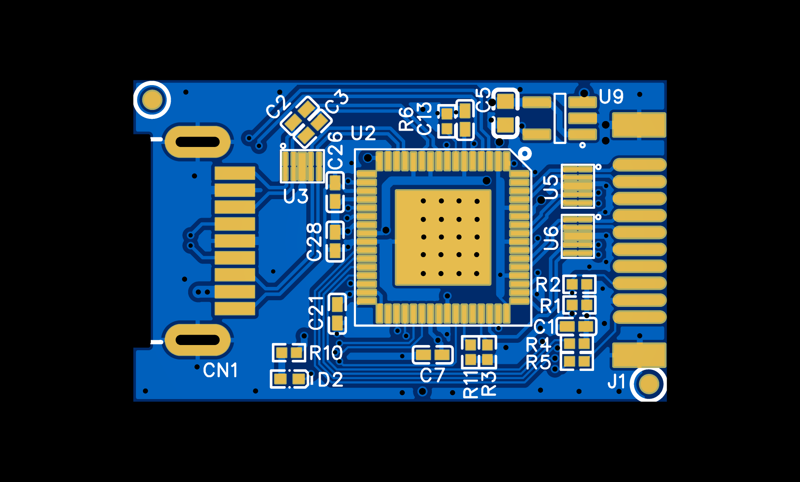
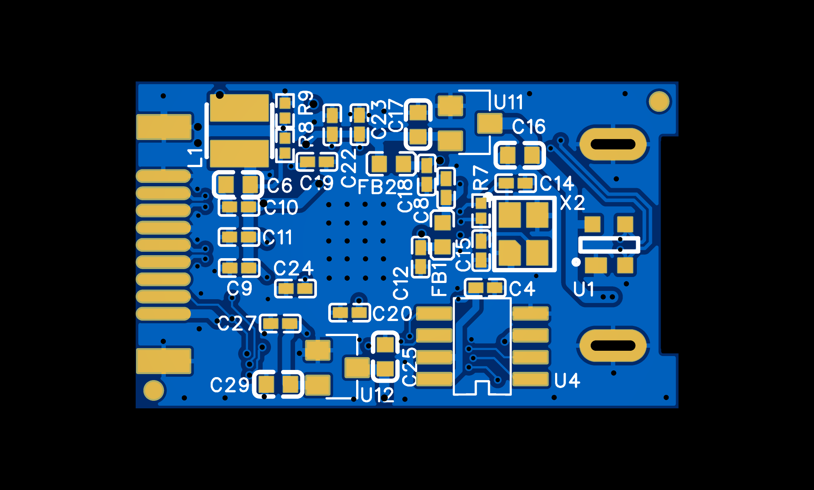
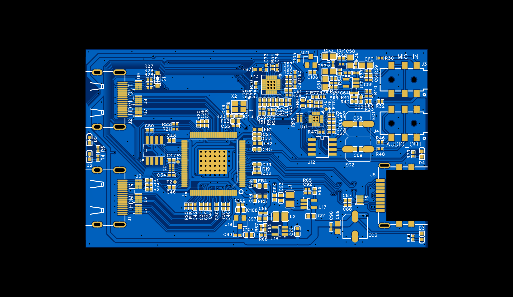
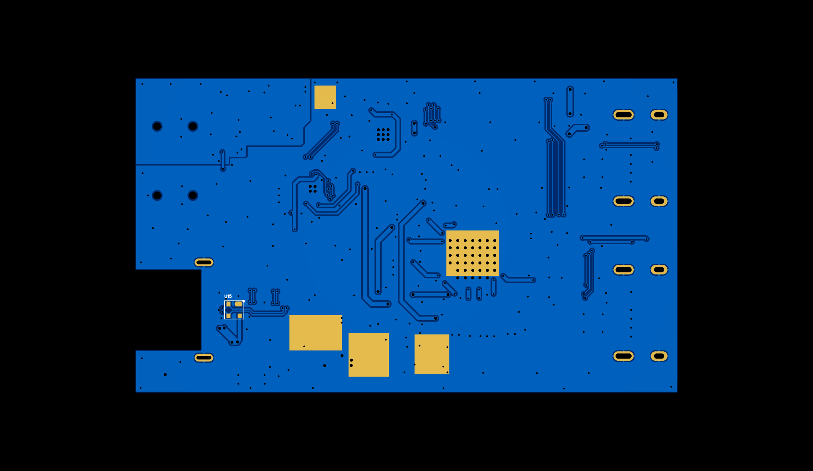

# MS2130 MS2131 Reference Design

## HardWare

  MS2130
  
  
  MS2131
  
  

## FirmWare
  [MS2130_sample_20221026](firmware/MS2130_sample_20221026.bin)
## Doc
  [MS2130 DS](doc/ms2130_ds.md)
## PCTool

## User Data

| ROM Address | Flash Address | Length  | User Data          | data type        |
|---          |---            |---      |---                 | ---              |
| 0x00F800    | 0x00F830      | 0x100   |edid                | uint8 array[256] |
| 0x00F900    | 0x00F930      | 0x120   |hdcpUserKey         | uint8 array[288] |
| 0x00FA20    | 0x00FA50      | 0x020   |ultrasemi           | uchar array[32]  |
| 0x00FA40    | 0x00FA70      | 0x020   |ultrasemi_version   | uchar array[32]  |
| 0x00FA60    | 0x00FA90      | 0x020   |ultrasemi_magic     | uint8 array[32]  |
| 0x00FA80    | 0x00FAB0      | 0x020   |ManufacturerString  | user_string_t    |
| 0x00FAA0    | 0x00FAD0      | 0x020   |ProduceString       | user_string_t    |
| 0x00FAC0    | 0x00FAF0      | 0x020   |U2ProduceString     | user_string_t    |
| 0x00FAE0    | 0x00FB10      | 0x020   |AudioString         | user_string_t    |
| 0x00FB00    | 0x00FB30      | 0x020   |U2AudioString       | user_string_t    |
| 0x00FB20    | 0x00FB50      | 0x020   |SerialnumString     | user_string_t    |
| 0x00FB40    | 0x00FB70      | 0x020   |U2SerialnumString   | user_string_t    |
| 0x00FB60    | 0x00FB90      | 0x020   |BCSH                | user_bcsh_t      |
| 0x00FB80    | 0x00FBB0      | 0x020   |AudioRoute          | audio_route_t    |

### user_string_t

* [Offset 0] length : uint8
  + 2 ~ 31
* [Offset 1:31] char array : uchar
  
### user_bcsh_t

  | Index | data type | data name |---              |
  |---    |---        |---        |---              |
  | 0     | UINT8     | bcsh_en   |0x01: User BCSH data Enable other: User BCSH data Disable|
  | 1     | INT8      | b         | -127 ~ 128      |
  | 2     | UINT8     | c         | 0 ~ 255         |
  | 3     | UINT8     | s         | 0 ~ 255         |
  | 3     | INT8      | h         | -127 ~ 128      |
  
### audio_route_t

* [Offset 0] sample_rate : UINT8
  + 0 : AUDIO_SR_48000
  + 1 : AUDIO_SR_96000
  + other : Not used
* [Offset 1] i2s_in_mode : UINT8
  + 0 : slave
  + 1 : master
  + other : Not used
* [Offset 2] mix3_mode : UINT8
  + 1 : HDMI RX
  + 2 : I2S1 IN
  + 3 : I2S1 IN & HDMI RX
  + 4 : I2S2
  + 5 : I2S2 IN & HDMI RX
  + 6 : I2S1 IN & I2S2 IN
  + 7 : I2S1 IN & I2S2 IN & HDMI RX
  + other : Not used
* [Offset 3] i2s1_mode : UINT8
  + 9  : HDMI RX
  + 10 : MIX3 & USB OUT
  + 11 : MIX3
  + 12 : USB OUT
  + other : Not used
* [Offset 4] usb_out_mute : UINT8
  + 0 : unmute
  + 1 : mute
  + other : Not used
* [Offset 5] lk621_en : UINT8
  + 0x00 : none
  + 0x01 : config lk621 @0x26
  + 0x02 : config lk621 @0x20
  + 0x03 : config lk621 both
  + other : Not used

